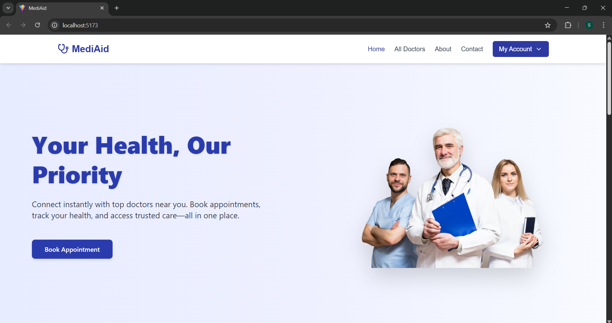
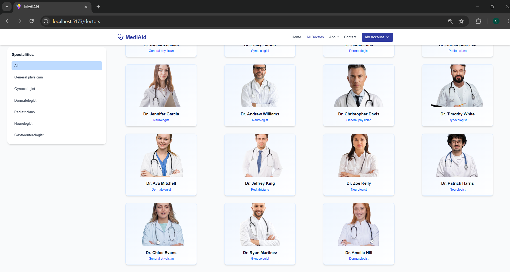
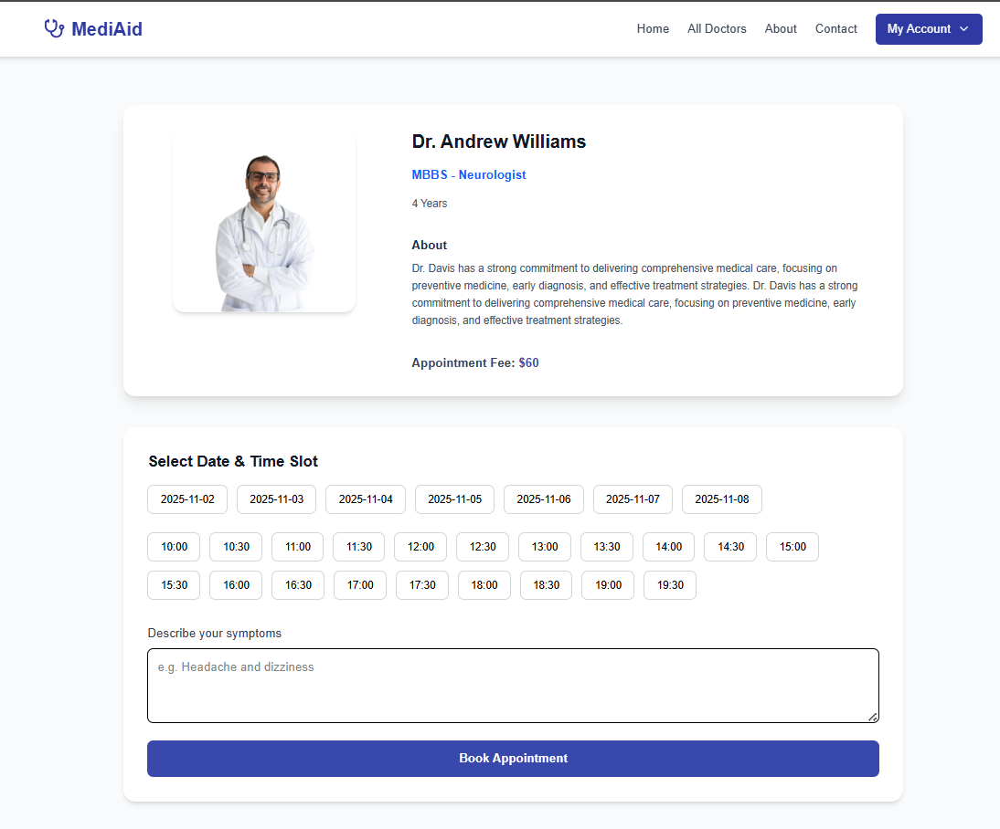

# 🩺 MediAid

MediAid is a full-stack doctor appointment management system that allows patients to book appointments with doctors, while doctors and admins can manage schedules and view bookings efficiently.

---

## 📸 Preview

### 🏠 Home Page

### 🩺 All Doctors

### 📅 Book Appointment

---

## ⚙️ Tech Stack

**Frontend (User + Admin Panels)**  
- React.js  
- React Router  
- Axios  
- Tailwind CSS / CSS  

**Backend**  
- Node.js  
- Express.js  
- MongoDB (Mongoose ORM)  
- JWT Authentication  

---

## 🚀 Features

✅ User Registration & Login (JWT-based Authentication)  
✅ Role-based Access (User, Doctor, Admin)  
✅ Book and Cancel Appointments  
✅ Doctor Dashboard to Manage Appointments  
✅ Admin Panel for Doctor Management  
✅ Responsive UI with modern design  
